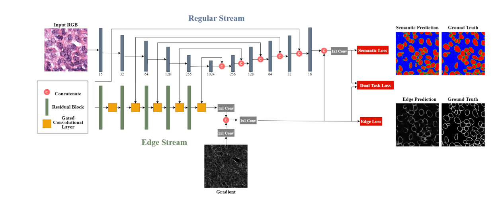

# GCNN Nuclei Segmentation
## About 
This repository contains the models and training code for the segmentation portioned of the attached thesis project.

Tumor Proliferation Assessment Challenge 2016 (TUPAC) dataset used for training and testing.

The Cancer Genome Atlas (TCGA) dataset used as an independent test dataset. 
# Architecture 
This work is inspired by [**Gated-SCNN: Gated Shape CNNs for Semantic Segmentation**](https://github.com/nv-tlabs/GSCNN).

[**Original Architecture**](https://openreview.net/pdf?id=fQDGt0RJkMu)

# Modifications
(1) Removal of gate 5 from original architecture.

(2) Replaced interpolation blocks with transpose convolution.

(3) Custom weight map based metric for clustered and overlapping regions of an image titled "Edge15" & "Nuclei15".
# Results
